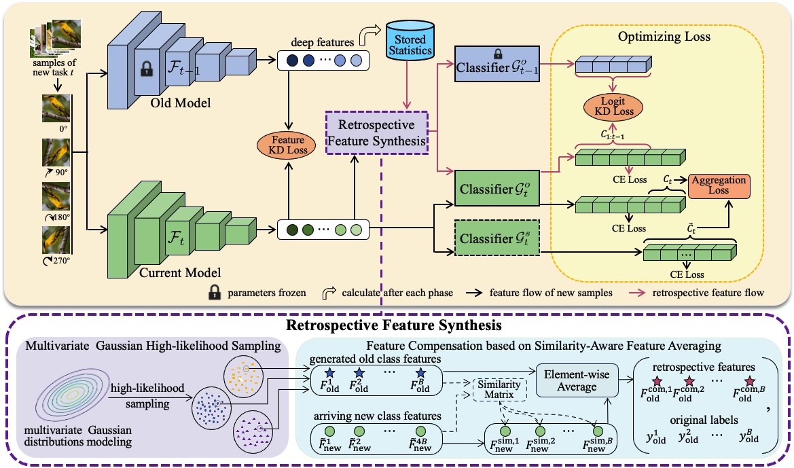

# Efficient Non-Exemplar Class-Incremental Learning with Retrospective Feature Synthesis

## Introduction
>Despite the outstanding performance in many individual tasks, deep convolutional neural networks suffer from catastrophic forgetting when learning from continuous data streams in real-world scenarios. Existing Non-Exemplar Class-Incremental Learning (NECIL) methods mitigate forgetting by storing a single prototype per class, which serves to inject previous information when sequentially learning new classes. However, these stored prototypes or their augmented variants often fail to simultaneously capture spatial distribution diversity and precision needed for representing old classes. Furthermore, as the model acquires new knowledge, these prototypes gradually become outdated, reducing their effectiveness. To overcome these limitations, we propose a more efficient NECIL method that replaces prototypes with synthesized retrospective features. Specifically, we model the feature space of each old class using a multivariate Gaussian distribution and generate deep representations by sampling from high-likelihood regions. Additionally, we introduce a feature compensation mechanism based on similarity-aware feature averaging, which integrates generated old class features with similar new class features to synthesize robust retrospective representations. These retrospective features are then incorporated into our incremental learning framework to preserve decision boundaries for previous classes while learning new ones. Extensive experiments on CIFAR-100, TinyImageNet, and ImageNet-Subset demonstrate that our method significantly improves the efficiency of NECIL, achieving state-of-the-art performance in accuracy and inference speed.

## Environments
- Python 3.8
- PyTorch 1.12.1
- CUDA 11.8
- torchvision 0.13.1

## Dataset

## Usage

***The complete code will be made publicly available after the paper is accepted.***

